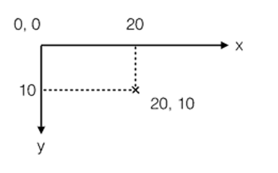
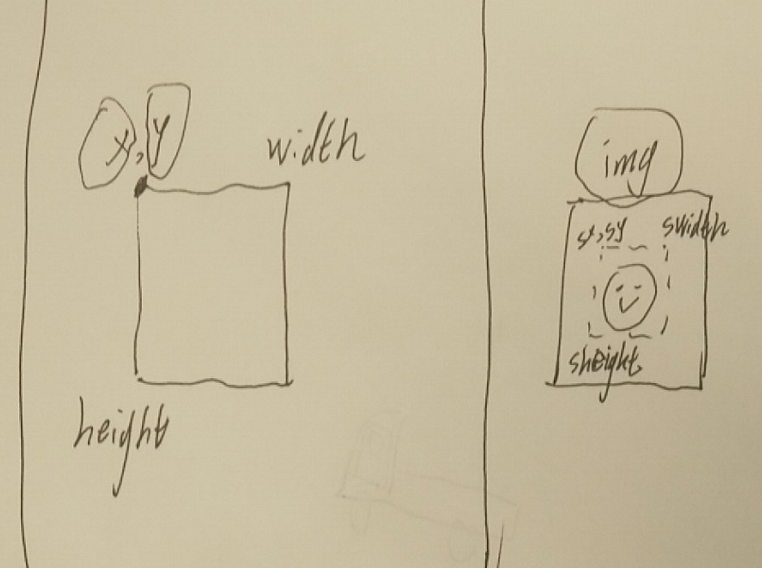

# 前端动效技术

随着互联网的发展，网页设计也愈发丰富多彩，近年来动效设计的强势崛起，使静态网页已经不能满足用户的体验。虽然设计师们已经掌握了制作动效的基本技能，但在网页中只依靠设计师输出的GIF动画，仍然不能完善用户与界面的交互体验，那么这就要求前端也得掌握动效应用能力了。

### 动效，一种属于前端程序员的浪漫

## css3动效技术:

```
1. transform 转换

translate(x,y)	
scale(x,y)	
rotate(angle)	
skew(x-angle,y-angle)	

2. transition 过渡

transition: property duration timing-function(ease/linear/cubic-bezier) delay;

3. animation 动画

animation: name duration timing-function delay iteration-count(n/infinite) direction(alternate);

@keyframes name
{
from {}
to {}
}

@keyframes name
{
0% {}
100% {}
}

```

=> [translate](http://www.w3school.com.cn/tiy/c.asp?f=css_transform_translate)
=> [scale](http://www.w3school.com.cn/tiy/c.asp?f=css_transform_scale)
=> [rotate](http://www.w3school.com.cn/tiy/c.asp?f=css_transform_rotate)

=> [transition](http://www.w3school.com.cn/tiy/t.asp?f=css3_transition)

=> [animation](http://www.w3school.com.cn/tiy/t.asp?f=css3_animation)


##  实例


##### => [外链跳转](https://api-m.haohuan.com/public/h5/externalChainSkip.html?url=https%3A%2F%2Fwww.haohuan.com%3Ftest%3D1)


## 更强大的绘图技术

### svg / canvas

VML 可以兼容低版本 IE，SVG 使得移动端不再为内存担忧，Canvas 可以轻松应对大数据量和特效的展现。

## canvas

Canvas是HTML5新增的组件，它就像一块画布，可以用JavaScript在上面绘制各种图表、动画等。

没有Canvas的年代，绘图只能借助Flash插件实现，页面不得不用JavaScript和Flash进行交互。有了Canvas，我们就再也不需要Flash了，直接使用JavaScript完成绘制。

一个Canvas定义了一个指定尺寸的矩形框(画布)，在这个范围内我们可以随意绘制


##### => [圣诞活动](http://api-m.haohuan.com/public/activity/ChristmasDay.html)

##### => [精彩介绍](https://www.imooc.com/video/2493)

## canvas 特点

##### 特点

1. html5图形标签

1. 只是容器,相当于提供了一个画布

1. 需要脚本来绘制图形

1. 依赖 api

##### 与 SVG 区别

1. canvas 依赖 api 绘图

1. svg 依赖 xml 文档描述绘图

=> [svg:canvas思维导图](canvas.svg)

## 画布

一个Canvas定义了一个指定尺寸的画布，在这个范围内我们可以随意绘制：

由于浏览器对HTML5标准支持不一致，所以，通常在canvas内部添加一些说明性HTML代码，如果浏览器支持Canvas，它将忽略canvas内部的HTML，如果浏览器不支持Canvas，它将显示canvas内部的HTML：

```
<canvas id='test' width='200' height='200' style='background:#fff'> <p>不支持 canvas</p> </canvas> 
```
## Canvas 坐标系

我们可以在Canvas上绘制各种形状。在绘制前，我们需要先了解一下Canvas的坐标系统：

Canvas的坐标以左上角为原点，水平向右为X轴，垂直向下为Y轴，以像素为单位，所以每个点都是非负整数




## 常用api

```
getContext 获取画笔
```
```

stroke()
fill()

arc(x,y,r,start,stop)
rect()

fillRect(x, y, width, height)	
strokeRect(x, y, width, height)	
clearRect(x, y, width, height)

beginPath()
moveTo()

```


## 绘图实例

```
var canvas = document.getElementById('test')
var ctx = canvas.getContext('2d'); 

ctx.clearRect(0, 0, 200, 200);
ctx.fillStyle = '#dddddd'; 
ctx.fillRect(10, 10, 130, 130); 


ctx.strokeStyle = "rgba(0, 0, 200, 0.5)";
ctx.strokeRect (30, 30, 90, 90);


ctx.arc(75, 75, 35, 0, 3.14, false);
ctx.moveTo(65, 65);
ctx.arc(60, 65, 5, 0, Math.PI*2, true);
ctx.moveTo(95, 65);
ctx.arc(90, 65, 5, 0, Math.PI*2, false);
ctx.strokeStyle = 'red';
ctx.stroke();

ctx.beginPath();
ctx.moveTo(75,50);
ctx.lineTo(100,25);
ctx.lineTo(50,25);
ctx.fillStyle = 'blue';
ctx.fill();

ctx.font="10px";
ctx.fillText("Hello World",50,160);


```

=> [模拟器](http://js.jirengu.com/?html,output)


## 实例(缩略图生成)

画布保存
```
context.drawImage(img,sx,sy,swidth,sheight,x,y,width,height);

toDataUrl()
```



=> [模拟器](http://js.jirengu.com/?html,output)

##### => [利用canvas缩略图片](http://jxjweb.top/2017/03/27.html)

## 实例(小游戏)

动画原理:

```
window.requestAnimationFrame 
```
- 绘制画布
- 清空画布

canvas绘制的模型可以自动调用硬件GPU加速

##### => [小游戏](http://jxjweb.gz01.bdysite.com/canvas/jump/play.html)
##### => [小程序逻辑](https://github.com/jxj322991/jump-game/blob/master/js/total.js)

## 技术展示

##### => [codepen](https://codepen.io/)

##### => [echarts](http://echarts.baidu.com/index.html)


## 肖健
## 2018/12/23
